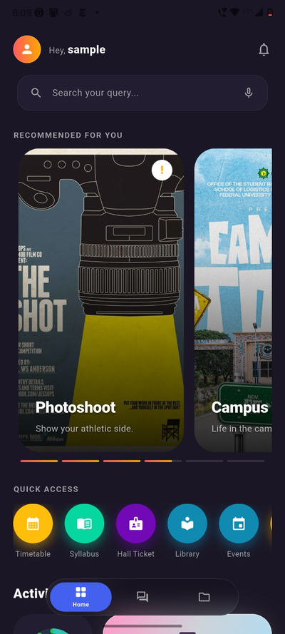
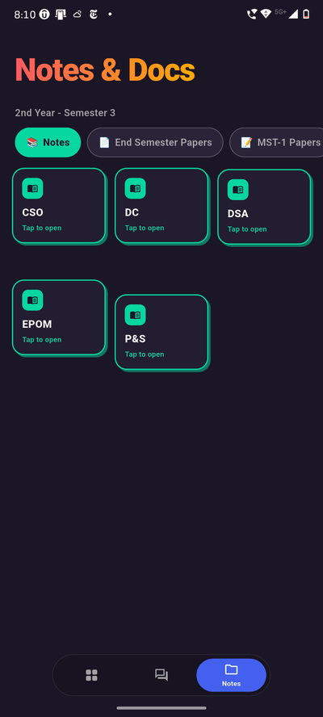
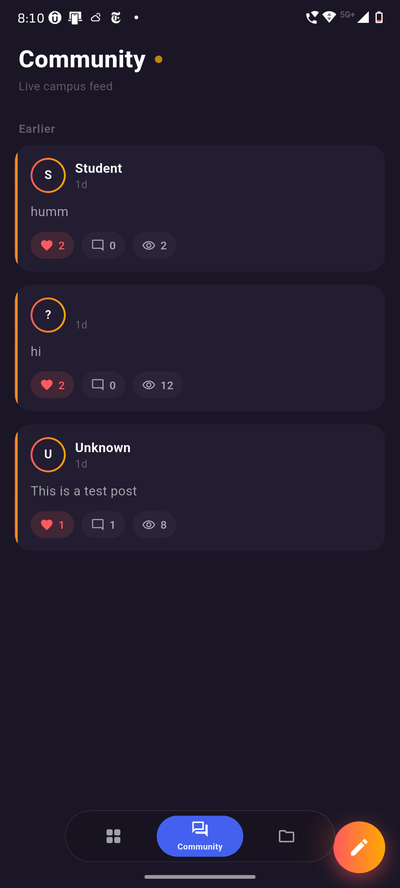

  

  # Classmate

  
<i>One app for everything college — timetable, notes, events, and the campus community, in one place.</i>

  <a href="#">Website</a> ·
  <a href="#features">Features</a> ·
  <a href="#screenshots">Screenshots</a> ·
  <a href="#tech-stack">Tech Stack</a> ·
  <a href="#a-note-on-this-repository">Security Note</a> ·
  <a href="#license">License</a>

---

## About

Classmate is a mobile app built for IPS Academy students to replace the scattered mess of WhatsApp groups, PDFs, and outdated college websites with a single, modern place for everything student life needs.

Most college apps look and feel like they were built a decade ago and abandoned since. Classmate is built the opposite way — fast, clean, and designed the way students actually expect an app to look and work in 2026.

The goal isn't just to digitize a noticeboard. It's to give every student one reliable place to check their timetable, track attendance, pull notes for any subject, stay on top of exams and academic dates, and actually talk to their batch — all without hunting through five different apps and group chats to find one PDF.

**Website:** [classmate.app](#) *(placeholder — link goes here once live)*

## Features

- **Home console** — attendance status at a glance, upcoming academic dates, and a promo carousel for college events, all without feeling cluttered
- **Community feed** — a Twitter-style feed scoped to your college, with posts and comments organized by section
- **Notes & Docs** — subject-wise notes and previous material, viewed in-app rather than through raw shared links
- **Verified badges** — class representatives, event organizers, and professors get verified badges through an approval process, so the feed stays trustworthy
- **Timetable & exams** — semester timetable, exam schedules, and hall tickets, always up to date
- **Built for one college first** — Classmate is being built and proven at IPS Academy before expanding to other campuses

## Screenshots

<table align="center">
  <tr>
    <td align="center" width="33%">
       
      <b>Home</b> — attendance, quick access, and what's next
    </td>
    <td align="center" width="33%">
       
      <b>Notes & Docs</b> — subject-wise material by semester
    </td>
    <td align="center" width="33%">
       
      <b>Community</b> — live campus feed
    </td>
  </tr>
</table>

## Tech Stack

- **Frontend:** Flutter
- **Backend:** Firebase (Authentication, Firestore)
- **Other:** Google Drive integration for notes delivery

## Status

Classmate is in active development. Core features — authentication, the community feed, and attendance tracking — are the current focus, with notes/docs and the academic calendar to follow.

## A Note on This Repository

This is a promotional repository shared for showcase purposes. Certain files have been intentionally excluded for security reasons, including platform build folders, Firebase configuration files (`google-services.json`, `GoogleService-Info.plist`, `firebase_options.dart`), environment files, and other credentials. This is by design and not an oversight.

## License

Copyright © 2026 Darshil Sharma. All rights reserved.

This is proprietary software. This repository and its contents — including source code, design, branding, and assets — are shared for portfolio and promotional purposes only. No permission is granted to copy, modify, distribute, or use any part of this project without explicit written consent from the author.

## Author

Built by [Darshil Sharma](https://github.com/DarshiL-Sharma).
